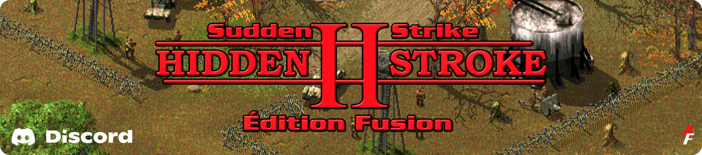

# MultiCAD — Zoom & Panels

**An extension of [MultiCAD](https://github.com/IvanishinV/MultiCAD) by [Vladislav Ivanishin (@IvanishinV)](https://github.com/IvanishinV)**, maintained by the [Alliance Francophone Sudden Strike](https://github.com/Alliance-Francophone-Sudden-Strike).

## How to play

[](https://discord.gg/3r2dVBGt7A?utm_source=github)

**Hidden Stroke 2 Fusion** but sharper. Zoom in mid-battle, track your groups, time every zeppelin capture.

With HS2 Fusion, you'll also get improved historical accuracy and resilience for all units, better-tuned targeting priorities, and other enhancements that make the gameplay experience more realistic and enjoyable. Bring your friends. :)

**[Join us on Discord!](https://discord.gg/3r2dVBGt7A?utm_source=github)**

_You can also directly download the latest build from our [releases page](../../releases) and follow the installation instructions there. It should allow you to activate the zoom feature in almost any other Sudden Strike related mod._

## Notice

Upstream **MultiCAD** is a universal graphics DLL replacement for **Sudden Strike**, **Sudden Strike Forever** and related games. It supports **any custom screen resolution** from 640x480 up to 3840x2160 (4K) and carries a long list of bug fixes across game versions. Everything that makes that possible — the reverse engineering, the per-version profiles, the renderer — is IvanishinV's work.

**This repository builds a layer on top of it.** It adds optional in-game features the base library does not set out to provide: a **battlefield zoom**, a **control-group panel** and a **zeppelin capture panel**, plus a few fixes found along the way.

> [!IMPORTANT]
> **Everything this AF version of the MultiCAD adds is off by default.** With no extra line in the game ini, the DLL built here behaves like the upstream one: resolution support and nothing else. Each feature is opted into explicitly, and the game must be restarted after editing the ini.

> **An enormous thanks to @IvanishinV for all the work poured into the original MultiCAD project. It was a long wait of more than 20 years.**

## Relationship to the upstream project

|                   |                                                                                                                                                                                                                                                                                                                                                              |
| ----------------- | ------------------------------------------------------------------------------------------------------------------------------------------------------------------------------------------------------------------------------------------------------------------------------------------------------------------------------------------------------------ |
| **From upstream** | Arbitrary resolutions, game/menu version detection and profiles, the per-version bug fixes listed in [Games Supported by MultiCAD](#games-supported-by-multicad), the renderer itself                                                                                                                                                                        |
| **Added here**    | [Battlefield zoom](#battlefield-zoom), [control-group panel](#control-group-panel), [zeppelin capture panel](#zeppelin-capture-panel), [module name override](#replacement-menu-or-game-modules), [profile forcing](#forcing-a-profile), the [fixes](#fixes-added-by-this-af-version-of-the-multicad) below, and a [MinGW cross-build](mingw/README.md) path |

This version of the MultiCAD tracks upstream rather than diverging from it. **Bug fixes made here that also affect the base library are proposed upstream as pull requests**, so they benefit every MultiCAD user instead of staying only in this version.

Where to report a problem:

- Resolution support, game detection or anything else that also happens with the upstream DLL → [IvanishinV/MultiCAD](https://github.com/IvanishinV/MultiCAD/issues).
- Zoom, the panels, or anything that only happens once one of the options below is enabled → [this repository's issues](../../issues).

If you are unsure, open it here; it will be forwarded upstream if it belongs there.

## AF MultiCAD feature support

The new features hook version-specific game code, so they are enabled per game version.

|                                              | Versions                                                                                                     |
| -------------------------------------------- | ------------------------------------------------------------------------------------------------------------ |
| **Zoom — verified in game**                  | Sudden Strike 2, Hidden Stroke 2, Resource War 2.4, Europe 2015, Sudden Strike Gold HD v1.2 (de, en, fr, ru) |
| **Zoom — supported, not yet played through** | Resource War 2.3, Black Sea, Black Gold, Sudden Strike Gold (en)                                             |
| **Control-group and zeppelin panels**        | Hidden Stroke 2 only, for now                                                                                |
| **Resolution support only**                  | Sudden Strike 1.0 and 1.2, Sudden Strike Gold de/fr/ru, Sudden Strike HD v1.1                                |

Versions listed as "resolution support only" behave exactly like upstream: the options below are read and stay inactive. If you need one of these features on a version that does not have it yet, [open an issue](../../issues).

> [!NOTE]
> At very high resolutions, zoom costs some performance. A large part of this version of MultiCAD's work went into rendering optimisations to keep it smooth.

## Games Supported by MultiCAD

See all the games supported by MultiCAD (HD resolution and various bug fixes only) in the original [repository description](https://github.com/IvanishinV/MultiCAD#supported-games).

## Installation

1. Download the latest precompiled `cadMulti_mt.dll` file from the [Releases](../../releases/latest) page. If your browser blocks the `.dll` download, take the `.zip` package containing it instead — the archive password is `zoom`.
2. Place `cadMulti_mt.dll` into the folder containing the original `cad*.dll` files (typically the game directory).
3. Open the game's ini in the game folder — `sudtest.ini` for Sudden Strike, or `gulfwar.ini`, `blackgold.ini`, `blacksea.ini`, `euro2015.ini` for the Confrontation titles — and set **at least one** `SSDraw` entry to `cadMulti_mt.dll`. Example:
   > ```ini
   > [Game]
   > SSDraw1=cad640.dll
   > SSDraw2=cad1024.dll
   > SSDraw3=cadMulti_mt.dll
   > ```
4. Launch the game.

## Configuration

### Resolution Setup

_Upstream feature._

The game launches at your desktop resolution by default — no configuration needed.

To set a specific resolution, add a `Resolution` line **anywhere after** the `[Game]` header in the game's ini:

> ```ini
> [Game]
> Resolution=1600x900
> SSDraw1=cad640.dll
> SSDraw2=cad1024.dll
> SSDraw3=cadMulti_mt.dll
> ```
>
> Restart the game to apply the change.

> 💡 Note: `Resolution` must be between 640x480 and 3840x2160. Out-of-range values are ignored with a message.
> Heights are rounded down to a multiple of 8 and widths to a multiple of 16 — the renderer and the fog-of-war blitter work in blocks of that size — so `1366x768` runs as `1360x768`. A mode your display then refuses brings up a picker listing the modes it does report, and saves your choice back to the ini. With no `Resolution` line set, the game uses your desktop resolution, rounded the same way.

### Battlefield Zoom

_Added by this AF version of the MultiCAD. Disabled by default._

Zoom into the battlefield with the **mouse wheel**, from 1x up to 2x in four steps.

> ```ini
> [Game]
> Zoom=on
> ```

- A small indicator shows the current zoom level.
- Everything keeps working while zoomed: the minimap and strategic-map view rectangle follow the zoomed area immediately, you can still reach the four corners of the battlefield, and the game can be paused and unpaused as usual.
- Map scrolling speed (edge scroll and keyboard) is scaled to the zoom level, so panning stays as precise as it feels at 1x. Minimap jumps and scripted camera moves are untouched.
- The image is rescaled with a sharpening filter rather than a plain stretch, so units and text stay readable at 2x.

| Setting                   | Values                      | Default   | What it does                                          |
| ------------------------- | --------------------------- | --------- | ----------------------------------------------------- |
| `Zoom`                    | `on` / `off`                | `off`     | Enables the feature                                   |
| `ZoomIndicator`           | `left` / `right` / `hidden` | `left`    | Where the level indicator sits                        |
| `ZoomIndicatorShape`      | `squares` / `bars`          | `squares` | Indicator style                                       |
| `ZoomIndicatorScale`      | `1`–`3`, steps of `0.25`    | `1`       | Bigger indicator for high resolutions                 |
| `PersistentZoomIndicator` | `on` / `off`                | `off`     | Keeps the indicator visible while zoomed in           |
| `InvertZoom`              | `on` / `off`                | `off`     | Reverses the wheel direction                          |
| `ZoomOnCursor`            | `on` / `off`                | `off`     | Zooms towards the cursor instead of the screen centre |

> ```ini
> [Game]
> Zoom=on
> ZoomIndicator=right
> ZoomIndicatorShape=bars
> ZoomIndicatorScale=1.5
> PersistentZoomIndicator=on
> InvertZoom=on
> ZoomOnCursor=on
> ```

`ZoomIndicatorScale` accepts `1` to `3` in steps of `0.25`. Values outside that range are clamped to the nearest bound and values between steps round to the nearest step, so `1.3` behaves as `1.25`. An indicator too large for the current resolution is not drawn.

### Control-Group Panel

_Added by this AF version of the MultiCAD. Disabled by default. **Hidden Stroke 2 only** for now._

A row of ten cells labelled `1`–`9` and `0` in the screen's **top-right corner**, showing the state of your control groups at a glance. Groups holding units light up; empty ones stay dim.

> ```ini
> [Game]
> GroupPanel=on
> ```

- Each lit cell shows the **number of units** in the group, centred just below it.
- Small badges tell you what is in the group: a **house** (top-right) for units inside a building, a **wheel** (bottom-left) for vehicle drivers, a **green square** (top-left) for transported units, and a **gun** (bottom-right) for artillery crews.
- The cells are **clickable**: left-click selects the group, exactly as pressing its number-row key does; right-click assigns the current selection to it, as `Ctrl` + the number key does.

| Setting                | Values                   | Default | What it does                                           |
| ---------------------- | ------------------------ | ------- | ------------------------------------------------------ |
| `GroupPanel`           | `on` / `off`             | `off`   | Enables the feature                                    |
| `GroupPanelCount`      | `on` / `off`             | `on`    | Shows the unit count under each lit cell               |
| `PersistentGroupPanel` | `on` / `off`             | `off`   | Keeps the panel on screen even when no group has units |
| `GroupPanelScale`      | `1`–`3`, steps of `0.25` | `1`     | Bigger panel for high resolutions                      |

> ```ini
> [Game]
> GroupPanel=on
> GroupPanelCount=off
> PersistentGroupPanel=on
> GroupPanelScale=2
> ```

`GroupPanelScale` uses the same clamping and rounding as `ZoomIndicatorScale`. The cells, glyphs, badges and counts all grow together, the panel stays anchored to the top-right corner, and the clickable area keeps matching what is drawn. A panel too large for the current resolution is not drawn at all.

### Zeppelin Capture Panel

_Added by this AF version of the MultiCAD. Disabled by default. **Hidden Stroke 2 only** for now._

On multiplayer maps built around capturing zeppelins, a list in the **bottom-right corner** of the groups you have not captured yet — one colour swatch per group, with its state to the left of it.

> ```ini
> [Game]
> ZeppelinPanel=on
> ```

- While you hold part of a group, the row shows how many you hold (`2/3`). Once you hold them all, it switches to a **live capture countdown**.
- If a started capture is interrupted, the countdown freezes and the row alternates every two seconds between the held count and the frozen time, both greyed out — so a running capture and an abandoned one are told apart at a glance, including once you hold none of the group. If an enemy capture resets the group, the count comes back on its own.
- A group drops off the list as soon as you own it.
- Press **`Alt` + `Z`** to show it. Either `Alt` key works, including `AltGr`.
- The panel only appears on maps that actually define zeppelin groups, so it stays out of the way in single-player and on ordinary multiplayer maps.

| Setting                  | Values                   | Default | What it does                                                                                 |
| ------------------------ | ------------------------ | ------- | -------------------------------------------------------------------------------------------- |
| `ZeppelinPanel`          | `on` / `off`             | `off`   | Enables the feature                                                                          |
| `ZeppelinPanelBehaviour` | `temp` / `toggle`        | `temp`  | `temp` fades the panel out after five seconds; `toggle` makes the shortcut open and close it |
| `ZeppelinPanelScale`     | `1`–`3`, steps of `0.25` | `1`     | Bigger panel for high resolutions                                                            |

> ```ini
> [Game]
> ZeppelinPanel=on
> ZeppelinPanelBehaviour=toggle
> ZeppelinPanelScale=1.5
> ```

With the default `temp` behaviour the panel stays up for five seconds then fades out, and pressing the shortcut again restarts those five seconds. `ZeppelinPanelScale` has its own value, independent of the control-group panel's, with the same clamping and rounding. The panel stays anchored to the bottom-right corner, and one too large for the current resolution is not drawn.

### Replacement Menu or Game Modules

_Added by this AF version of the MultiCAD._

The game binds its two modules by name, from the ini it boots with:

> ```ini
> [StartUp]
> Module1=Menu_Dll.dll
> Module2=Game_Dll.dll
> ```

MultiCAD reads the same two keys, so a replacement menu under any name, for example `Module1=Anything.dll`, is still recognised as the menu module, on disk and when it loads.
No configuration is needed; the usual `menu*.dll` / `game*.dll` names remain the fallback when the keys are absent.

### Forcing a Profile

_Added by this AF version of the MultiCAD. For advanced users._

MultiCAD identifies your game by hashing the code section of its `game*.dll` and `menu*.dll`. A dll it doesn't recognise, like a custom or repacked build, is simply left unpatched: the menu is skipped silently, and the game falls back to 1024x768 with a message naming the hash it computed.

If you know which version a custom dll is based on, you can force the matching profile from the `[Game]` section of the game ini:

> ```ini
> [Game]
> GameProfile=SS_2
> MenuProfile=SS_2
> ```

`GameProfile` covers the game dll, `MenuProfile` the menu dll; set either or both.
Accepted values (case-insensitive):

`SS_V1_0`, `SS_V1_2`, `SS_GOLD_RU`, `SS_GOLD_EN`, `SS_GOLD_DE`, `SS_GOLD_FR`, `SS_2`,
`SS_RW_V2_3`, `SS_RW_V2_4`, `SS_BLACK_GOLD`, `SS_EUROPE_2015`, `SS_BLACK_SEA`,
`SS_HD_V1_1_RU`, `SS_HD_V1_1_EN`, `SS_GOLD_HD_1_2_RU`, `SS_GOLD_HD_1_2_INT`, `HS_2`.

Anything else is ignored and normal detection applies.

> ⚠️ **At your own risk.** Forcing a profile writes jumps at fixed addresses into a dll whose contents haven't been verified. If the profile doesn't match the dll, the game will crash as soon as a patched function runs. Only use this when you know the build your dll came from, and remove the line if the game stops starting.

### UI Toggle Hotkey

You can temporarily disable or enable the in-game UI overlay by pressing:

**Alt + Y**

This can be useful when taking screenshots or when the UI interferes with gameplay. In this AF version of the MultiCAD it also hides the zoom indicator, for clean screenshots.

## Fixes Added by This AF Version of the MultiCAD

These are on top of the upstream fix list. The ones that apply to the base library are offered upstream as pull requests.

- **Garbled characters in chat.** Typing accented or multi-byte characters no longer produces random or corrupted letters in the chat box.
- **Crash when selecting a recon plane** that had reached its destination — a division by zero in the progress-bar drawing. Affects Sudden Strike 2 and Hidden Stroke 2.
- **Crash when opening the strategic map on ultra-wide resolutions** has normally been addressed (needs further testing).
- **Explicit resolution rounding**, described in [Resolution Setup](#resolution-setup), with a mode picker when the display refuses the requested mode.
- Rendering was reorganised internally ("world isolation") to keep the frame rate up with the new overlays and zoom enabled.

## Compilation

### Visual Studio (reference build)

Requirements:

- Windows 10 or 11
- Visual Studio 2022 or later
- Visual C++ build tools

Steps:

1. Clone or download this repository.
2. Open `MultiCAD.sln` in **Visual Studio 2022**.
3. Choose the `Release`, `Release_MT` or `Debug` configuration.
4. Build the solution.

### MinGW-w64 cross build (Linux)

_Added by this AF version of the MultiCAD._ The Visual Studio project stays the source of truth; `make` in [mingw/](mingw/) produces the same DLLs on a Linux box with no MSVC. See [mingw/README.md](mingw/README.md).

## License

This project is licensed under the MIT License — see the [LICENSE](LICENSE) file for details. Copyright on the original work remains with Vladislav Ivanishin.

## Contact

For author information and ways to get in touch, see the [Contact Information](CONTACT.md) file.
