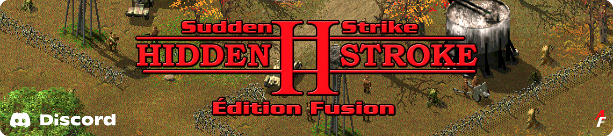

# MultiCAD with Zoom

**An extension of [MultiCAD](https://github.com/IvanishinV/MultiCAD) by [Vladislav Ivanishin (@IvanishinV)](https://github.com/IvanishinV)**, maintained by the [Alliance Francophone Sudden Strike](https://github.com/Alliance-Francophone-Sudden-Strike).

> **An enormous thanks to @IvanishinV for all the work poured into the original MultiCAD project. It was a long wait of more than 20 years.**

## How to play

[](https://discord.gg/3r2dVBGt7A?utm_source=github)

**Hidden Stroke 2 Fusion** but sharper. Zoom in mid-battle, track your groups, time every zeppelin capture.

With HS2 Fusion, you'll also get improved historical accuracy and resilience for all units, better-tuned targeting priorities, and other enhancements that make the gameplay experience more realistic and enjoyable. Bring your friends. :)

**[Join us on Discord!](https://discord.gg/3r2dVBGt7A?utm_source=github)**

_You can also directly download the latest build from our [releases page](../../releases) and follow the installation instructions there. It should allow you to activate the zoom feature in almost any other Sudden Strike related mod._

## AF MultiCAD feature support

The zoom feature has been confirmed to work in **Sudden Strike 2**, **Hidden Stroke 2**, **Resource War 2.4**, **Europe 2015**, **Sudden Strike Gold HD v1.2** (de, en, fr, ru) with live testing. **Resource War 2.3**, **Black Sea**, **Black Gold**, **Sudden Strike Gold (en)** should also work, but have not been fully tested yet.

> [!NOTE]
> Zoom costs some performance, this is why the CNC DDRAW is required as it mitigates the impact on performance. **A CNC DDRAW version adapted for the Sudden Strike series is included in the release package**.

> More about the CNC: cnc-ddraw can fix compatibility issues in older 2D games, such as black screen, bad performance, crashes or defective Alt+Tab. It does also add new features such as borderless mode, windowed mode and upscaling via shaders. For more information, visit the [cnc-ddraw GitHub page](https://github.com/FunkyFr3sh/cnc-ddraw).

## Installation

1. Download the latest installation `.zip` in the [Releases](../../releases/latest) page. _It is possible that your browser may block the download as the `.zip` file contains `.dll` files, you should be able to bypass this by explicitly allowing the download_.
2. Extract the contents of the `.zip` file into the game's directory (where both the game `.exe` and `.ini` configuration files are located).
3. Open the game's ini in the game folder (`sudtest.ini` for Sudden Strike, or `gulfwar.ini`, `blackgold.ini`, `blacksea.ini`, `euro2015.ini` for the Confrontation titles) and set **at least one** `SSDraw` entry to `cadMulti_mt.dll`. Example:
   > ```ini
   > [Game]
   > SSDraw1=cad640.dll
   > SSDraw2=cad1024.dll
   > SSDraw3=cadMulti_mt.dll
   > ```
4. Launch the game.

## Configuration

### Resolution Setup

The game launches at your desktop resolution by default: no other configuration is needed.

To set a specific resolution, add a `Resolution` line **anywhere after** the `[Game]` header in the game's ini:

> ```ini
> [Game]
> Resolution=1600x900
> SSDraw1=cad640.dll
> SSDraw2=cad1024.dll
> SSDraw3=cadMulti_mt.dll
> ```
>
> Restart the game to apply the change.

> [!NOTE]
> `Resolution` must be between 640x480 and 3840x2160. Out-of-range values are ignored with a message.
> Heights are rounded down to a multiple of 8 and widths to a multiple of 16 so `1366x768` runs as `1360x768`.

### Battlefield Zoom

_Added by this AF version of the MultiCAD. Disabled by default._

Zoom into the battlefield with the **mouse wheel**, from 1x up to 2x in four steps.

> ```ini
> [Game]
> Zoom=on
> ```

| Setting                   | Values                      | Default   | What it does                                          |
| ------------------------- | --------------------------- | --------- | ----------------------------------------------------- |
| `Zoom`                    | `on` / `off`                | `off`     | Enables the feature                                   |
| `ZoomIndicator`           | `left` / `right` / `hidden` | `left`    | Where the level indicator sits                        |
| `ZoomIndicatorShape`      | `squares` / `bars`          | `squares` | Indicator style                                       |
| `ZoomIndicatorScale`      | `1`–`3`, steps of `0.25`    | `1`       | Bigger indicator for high resolutions                 |
| `PersistentZoomIndicator` | `on` / `off`                | `off`     | Keeps the indicator visible while zoomed in           |
| `InvertZoom`              | `on` / `off`                | `off`     | Reverses the wheel direction                          |
| `ZoomOnCursor`            | `on` / `off`                | `off`     | Zooms towards the cursor instead of the screen centre |

Example configuration:

> ```ini
> [Game]
> Zoom=on
> ZoomIndicator=right
> ZoomIndicatorShape=bars
> ZoomIndicatorScale=1.25
> PersistentZoomIndicator=on
> InvertZoom=on
> ZoomOnCursor=on
> ```

`ZoomIndicatorScale` accepts `1` to `3` in steps of `0.25`. Values outside that range are clamped to the nearest bound and values between steps round to the nearest step, so `1.3` behaves as `1.25`. If your indicator disappears, it is likely that you used a too high value for your current resolution which causes it to be drawn off-screen.

<details>
<summary>Other Settings in testing phase only working with Sudden Strike 2 and Hidden Stroke 2</summary>

### Control-Group Panel

_Added by this AF version of the MultiCAD. Disabled by default. Available only for Sudden Strike 2 and Hidden Stroke 2._

A row of ten cells labelled `1`–`9` and `0` in the screen's **top-right corner**, showing the state of your control groups at a glance. Groups holding units light up; empty ones stay dim.

In-game tests found false active groups and incorrect counts in Resource War 2.4 (including HS2 RW). The panel also failed in Sudden Strike Gold HD v1.2. Sudden Strike Gold (en) shares the Gold binding and is also classified incompatible. Resource War 2.3, Europe 2015 and Black Sea remain untested. The panel is disabled for all of these profiles even if `GroupPanel=on`; zoom support is unaffected.

> ```ini
> [Game]
> GroupPanel=on
> ```

- Each lit cell shows the **number of units** in the group, centred just below it.
- Small badges tell you what is in the group: a **house** (top-right) for units inside a building, a **wheel** (bottom-left) for vehicle drivers, a **green square** (top-left) for transported units, and a **gun** (bottom-right) for artillery crews.
- The cells are **clickable**: left-click selects the group, exactly as pressing its number-row key does; right-click assigns the current selection to it, as `Ctrl` + the number key does.

| Setting                | Values                   | Default | What it does                                           |
| ---------------------- | ------------------------ | ------- | ------------------------------------------------------ |
| `GroupPanel`           | `on` / `off`             | `off`   | Enables the feature                                    |
| `GroupPanelCount`      | `on` / `off`             | `on`    | Shows the unit count under each lit cell               |
| `PersistentGroupPanel` | `on` / `off`             | `off`   | Keeps the panel on screen even when no group has units |
| `GroupPanelScale`      | `1`–`3`, steps of `0.25` | `1`     | Bigger panel for high resolutions                      |

Example configuration:

> ```ini
> [Game]
> GroupPanel=on
> GroupPanelCount=off
> PersistentGroupPanel=on
> GroupPanelScale=2
> ```

### Zeppelin Capture Panel

_Added by this AF version of the MultiCAD. Disabled by default. **Hidden Stroke 2 only** for now._

On multiplayer maps built around capturing zeppelins, a list in the **bottom-right corner** of the groups you have not captured yet. One colour swatch per group, with its state to the left of it.

> ```ini
> [Game]
> ZeppelinPanel=on
> ```

- While you hold part of a group, the row shows how many you hold (`2/3`). Once you hold them all, it switches to a **live capture countdown**.
- If a started capture is interrupted, the countdown freezes and the row alternates every two seconds between the held count and the frozen time, both greyed out, so a running capture and an abandoned one are told apart at a glance, including once you hold none of the group. If an enemy capture resets the group, the count comes back on its own.
- A group drops off the list as soon as you own it.
- Press **`Alt` + `Z`** to show it. Either `Alt` key works, including `AltGr`.
- The panel only appears on maps that actually define zeppelin groups, so it stays out of the way in single-player and on ordinary multiplayer maps.

| Setting                  | Values                   | Default | What it does                                                                                 |
| ------------------------ | ------------------------ | ------- | -------------------------------------------------------------------------------------------- |
| `ZeppelinPanel`          | `on` / `off`             | `off`   | Enables the feature                                                                          |
| `ZeppelinPanelBehaviour` | `temp` / `toggle`        | `temp`  | `temp` fades the panel out after five seconds; `toggle` makes the shortcut open and close it |
| `ZeppelinPanelScale`     | `1`–`3`, steps of `0.25` | `1`     | Bigger panel for high resolutions                                                            |

Example configuration:

> ```ini
> [Game]
> ZeppelinPanel=on
> ZeppelinPanelBehaviour=toggle
> ZeppelinPanelScale=1.5
> ```

With the default `temp` behaviour the panel stays up for five seconds then fades out, and pressing the shortcut again restarts those five seconds.

### Replacement Menu or Game Modules

_Added by this AF version of the MultiCAD._

The game binds its two modules by name, from the ini it boots with:

> ```ini
> [StartUp]
> Module1=Menu_Dll.dll
> Module2=Game_Dll.dll
> ```

MultiCAD reads the same two keys, so a replacement menu under any name, for example `Module1=Anything.dll`, is still recognised as the menu module, on disk and when it loads.
No configuration is needed; the usual `menu*.dll` / `game*.dll` names remain the fallback when the keys are absent.

### Forcing a Profile

_Added by this AF version of the MultiCAD. For advanced users._

MultiCAD identifies your game by hashing the code section of its `game*.dll` and `menu*.dll`. A dll it doesn't recognise, like a custom or repacked build, is simply left unpatched: the menu is skipped silently, and the game falls back to 1024x768 with a message naming the hash it computed.

If you know which version a custom dll is based on, you can force the matching profile from the `[Game]` section of the game ini:

> ```ini
> [Game]
> GameProfile=SS_2
> MenuProfile=SS_2
> ```

`GameProfile` covers the game dll, `MenuProfile` the menu dll; set either or both.
Accepted values (case-insensitive):

`SS_V1_0`, `SS_V1_2`, `SS_GOLD_RU`, `SS_GOLD_EN`, `SS_GOLD_DE`, `SS_GOLD_FR`, `SS_2`,
`SS_RW_V2_3`, `SS_RW_V2_4`, `SS_BLACK_GOLD`, `SS_EUROPE_2015`, `SS_BLACK_SEA`,
`SS_HD_V1_1_RU`, `SS_HD_V1_1_EN`, `SS_GOLD_HD_1_2_RU`, `SS_GOLD_HD_1_2_INT`, `HS_2`.

Anything else is ignored and normal detection applies.

> ⚠️ **At your own risk.** Forcing a profile writes jumps at fixed addresses into a dll whose contents haven't been verified. If the profile doesn't match the dll, the game will crash as soon as a patched function runs. Only use this when you know the build your dll came from, and remove the line if the game stops starting.

</details>

## Fixes Added by This AF Version of the MultiCAD

These are on top of the upstream fix list. The ones that apply to the base library are offered upstream as pull requests.

- **Crash when selecting a recon plane** that had reached its destination: a division by zero in the progress-bar drawing. Affects Sudden Strike 2 and Hidden Stroke 2.
- **Crash when opening the strategic map on ultra-wide resolutions** has normally been addressed (needs further testing).
- Rendering was reorganised internally ("world isolation") to keep the frame rate up with the new overlays and zoom enabled.

## Compilation

### Visual Studio (reference build)

Requirements:

- Windows 10 or 11
- Visual Studio 2022 or later
- Visual C++ build tools

Steps:

1. Clone or download this repository.
2. Open `MultiCAD.sln` in **Visual Studio 2022**.
3. Choose the `Release`, `Release_MT` or `Debug` configuration.
4. Build the solution.

### MinGW-w64 cross build (Linux)

_Added by this AF version of the MultiCAD._ The Visual Studio project stays the source of truth; `make` in [mingw/](mingw/) produces the same DLLs on a Linux box with no MSVC. See [mingw/README.md](mingw/README.md).

## License

This project is licensed under the MIT License. See the [LICENSE](LICENSE) file for details. Copyright on the original work remains with Vladislav Ivanishin.

## Contact

For author information and ways to get in touch, see the [Contact Information](CONTACT.md) file.
